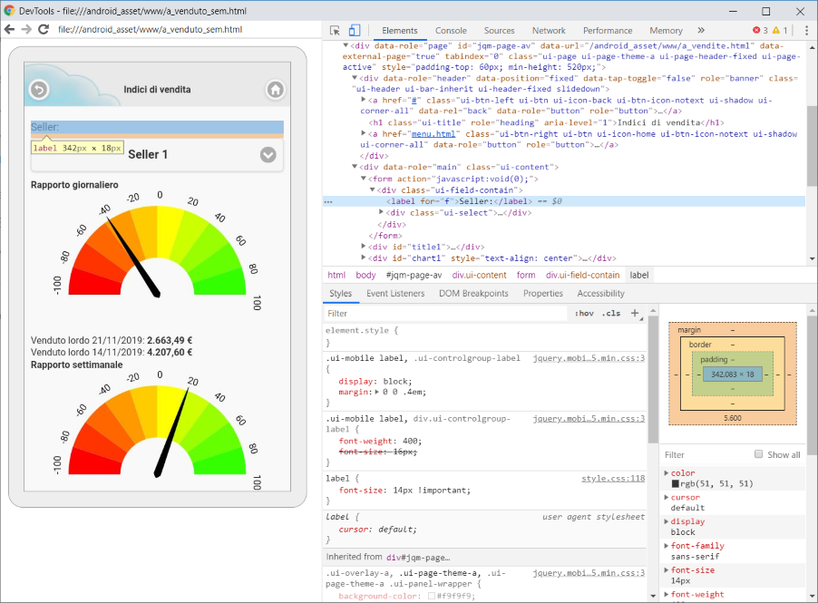

# WApp - Wrapped App Mobile

A template of Cordova hybrid app based on jQuery Mobile.

## Requirements

- [Install Android SDK tools](https://developer.android.com)
- [Install Gradle Build Tool](https://gradle.org)
- [Install NodeJS](https://nodejs.org)
- `npm install -g cordova`

## Build

- `git clone https://github.com/giosil/wapp.git`
- `cordova platform add android`
- `cordova build`

## Plugins used

- `cordova plugin add cordova-plugin-whitelist --save`
- `cordova plugin add cordova-plugin-x-toast --save`
- `cordova plugin add cordova-plugin-splashscreen --save`
- `cordova plugin add https://github.com/katzer/cordova-plugin-local-notifications --save`
- `cordova plugin add https://github.com/wildabeast/BarcodeScanner.git --save`
- `cordova plugin add cordova.plugins.diagnostic --save`
- `cordova plugin add cordova-custom-config --save`

## Run

- `cordova run android --device`

## Debug

- `chrome://inspect` on Chrome URL bar

## Try it directly

Install dist/wapp.apk on an Android device.

## Contributors

* [Giorgio Silvestris](https://github.com/giosil)
